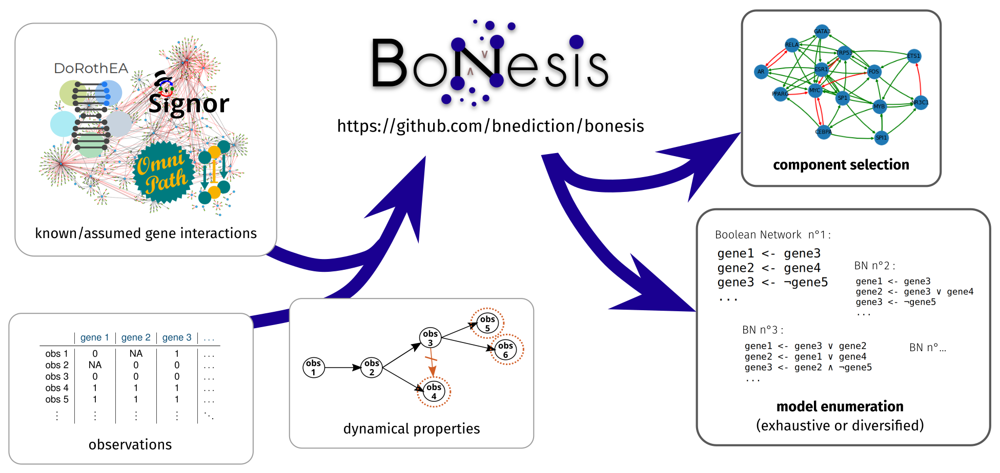

## Motivation for research

**High interest in some challenging multisystemic disorders.**
I aim at contributing in related fundamental research and help the translation of basic science results into health care advances.

Via bioinformatics, I have a special affinity for **the holistic approach of systems biology** to unravel and predict biological phenomena.
I trained in bioinformatics with internships in different areas of this discipline: the challenge of **data integration**, **NGS analysis**, **structural analysis** for drug design, and finally the one of complex **biological systems analysis and modelling**. I then approached related issues from different viewpoints.

## Overview of my doctorate

**PhD in computer science for a systems biology issue:** <important>modelling of regulatory mechanisms</important>.

I contributed to a method for <important>automatic inference of discrete dynamical models of biological interactions</important> governing complex cell behaviors, called <important>BoNesis</important>.
It allows to **model regulatory mechanisms of biological processes with complex dynamic properties**, such as cell differentiation, by taking into account **knowledge on thousands of genes**.

[{:class="img-page"}](https://github.com/bnediction/bonesis)

This modeling confronts **prior knowledge** on interactions with **observations** along the process to model (bulk/single cell gene expressions, perturbations, mutations...). It can then <important>enumerate all Boolean networks reproducing a complex behavior</important> (under _[mp semantics](https://hal.archives-ouvertes.fr/hal-01864693v2/document)_), e.g. cell differentiation. It can also be used to help <important>select relevant nodes among a large prior knowledge network</important> (e.g. from public interaction databases).

## Interest in Bioinformatics

Main skills developped during the doctorate : **discrete dynamical modelling** and **logic programming**. I also notably became aware of the opportunities and biases of **single-cell data**.
