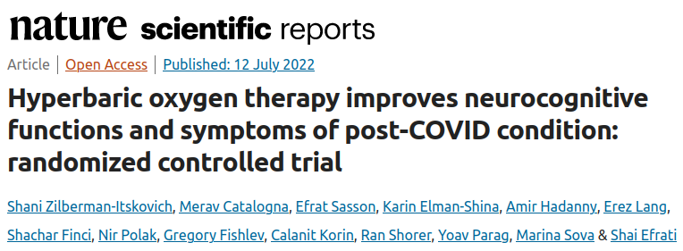
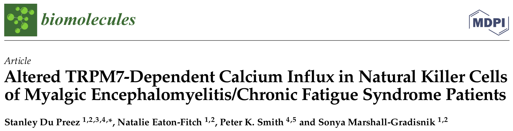
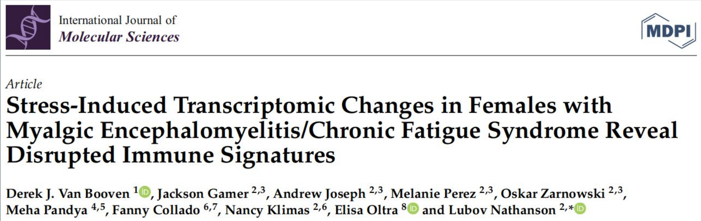
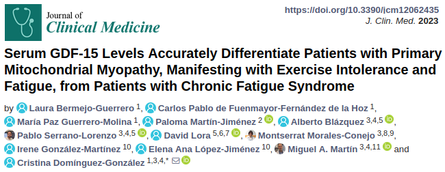
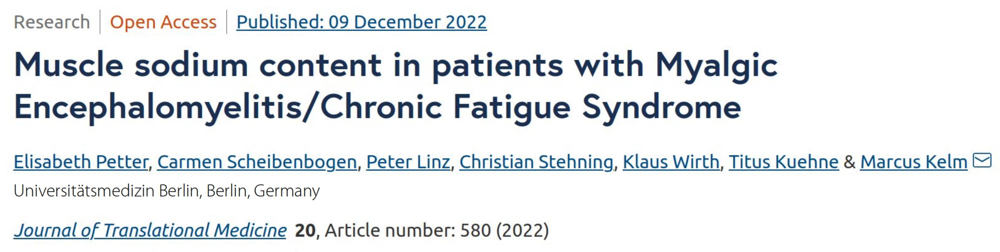
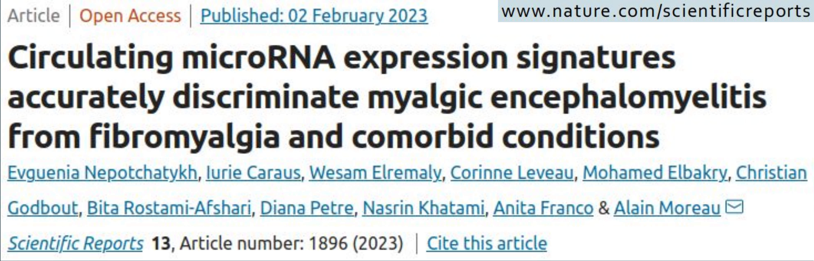
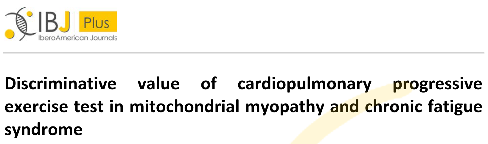
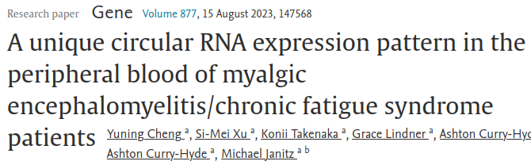

# Veille sur EM/SFC et COVID long

## Communications (en anglais) :

### Ressources pour patients et professionnels de santé :

- [Symptoms of ME/CFS (from *Centers for Disease Control and Prevention* - USA)](https://www.cdc.gov/me-cfs/symptoms-diagnosis/symptoms.html)
- [Open Medicine Foundation](https://www.omf.ngo/what-is-mecfs/)  
- [Bateman Horne Center](https://batemanhornecenter.org/)

### NIH ME/CFS working group :

- **[<small_emphasis>Séminaires "ME/CFS Research Roadmap"</small_emphasis>](https://event.roseliassociates.com/me-cfs-research-roadmap/recordings/)** : webinaires thématiques qui réunissent chercheurs, cliniciens et acteurs associatifs autour de l'EM/SFC. Objectif : états de l'art thématiques (études scientifiques menées, résultats, lacunes, perspectives). [Le programme](https://event.roseliassociates.com/me-cfs-research-roadmap/agendas/) des webinaires et [leurs enregistrements (et retranscriptions)](https://event.roseliassociates.com/me-cfs-research-roadmap/recordings/) sont disponibles en ligne.  
    - 25/08/2023 : [**Système nerveux**](https://youtu.be/f6KJH1_QhIg?si=cn5TPWMFnDOmRcaK)
    - 19/10/2023 : [**Système immunitaire**](https://youtu.be/6al3hkRo4mo?si=K8bFOLo3dbElEsqH)
    - 26/10/2023 : [**Métabolisme**](https://youtu.be/nLRqb5RM2rY?si=JjZWyf_SJA7JLrUe)
    - 01/11/2023 : [**Génomique / Prédispositions génétiques**](https://youtu.be/3Sv93qHF0WQ?si=_11N-W1zQ2x19uwT)
    - 30/11/2023 : [**Infections chroniques**](https://youtu.be/s1e4uWYJgGw?si=SiWW3sop-hEDV4Vh)
    - 08/12/2023 : [**Physiologie**](https://youtu.be/Y5AvIGvjyO4?si=xsJHUhlvRnNlOvYd)

- **[<small_emphasis>Conférence "Advancing ME/CFS Research: Identifying Targets for Intervention and Learning from Long COVID"</small_emphasis>](https://web.cvent.com/event/efc45a4d-bcc1-4832-b537-8905ae828077/summary)** (12 et 13 décembre 2023)

## Veille bibliographique (avec synthèses en français) :

* [Neurologie](#neuro)
* [Gastro-entérologie](#gastro)
* [Immunologie](#immuno)
* [Métabolisme](#metabo)
* [Angiologie](#angio)
* [Biologie moléculaire](#biomol)

<small_emphasis>Quand une image est associée au titre de la publication, un résumé en français de l'étude est accessible en cliquant sur l'image.</small_emphasis>

+ 02/2024: <important>[Phénotypage profond de l'EM/SFC post-infectieuse](https://www.nature.com/articles/s41467-024-45107-3)</important>

### Neurologie 
+ 07/2022: <important>Une thérapie d’oxygénothérapie hyperbare améliore les fonctions neurocognitives et les symptômes de l’état post-COVID : essai contrôlé randomisé</important>  
[{:class="img-vignette"}](../files/EMSFC/2022-07_HBOT.html)
     - **étaye un précédent résultat sur patient EM/SFC :**  
     (résumé à venir) [Hypométabolisme cérébral généralisé (TEP 18F-FDG) dans le syndrome de fatigue chronique traité par oxygénothérapie hyperbare](https://link.springer.com/article/10.1007/s00259-020-05122-0), *European Journal of Nuclear Medicine and Molecular Imaging*, 2021/05

+ Travaux de Angus Mackay sur la neuroinflammation :
     - [Un paradigme neuroinflammatoire peut expliquer l'EM/SFC et le syndrome de fatigue post-COVID-19](https://ourarchive.otago.ac.nz/handle/10523/15089), manuscrit de thèse, 2023/03, regroupant :
         - (résumé à venir) [Un paradigme pour le syndrome de fatigue post-Covid-19 analogue à l'EM/SFC](https://www.frontiersin.org/articles/10.3389/fneur.2021.701419/full), Frontiers in Neurology, 2021/08
         - [Un modèle neuro-inflammatoire peut expliquer l'apparition, les symptômes et les poussées de l'EM/SFC](https://www.publish.csiro.au/hc/HC19041), Journal of Primary Health Care, 2019/11
         - [Les recherches actuelles donnent un aperçu des bases biologiques et du potentiel diagnostique de l'EM/SFC](https://www.mdpi.com/2075-4418/9/3/73), Diagnostics, 2019/07

+ (résumé à venir) [Le flux sanguin cérébral est réduit dans l'EM/SFC lors du test d'inclinaison tête haute, même en l'absence d'hypotension ou de tachycardie : étude quantitative contrôlée utilisant l'échographie Doppler](https://www.sciencedirect.com/science/article/pii/S2467981X20300044), Clinical Neurophysiology Practice, 2020/01

### Gastro-entérologie (& immuno) 
+ (résumé à venir) [Augmentation de la perméabilité intestinale et translocation bactérienne sont associées à fibromyalgie et EM/SFC : implications pour la découverte de biomarqueurs](https://www.frontiersin.org/articles/10.3389/fimmu.2023.1253121/abstract), Frontiers in Immunology, 2023/08

+ 02/2023: <important>Dans l'EM/SFC, association entre production insuffisante de butyrate dans le microbiome intestinal et perturbations du réseau bactérien + symptômes de fatigue.</important>  
[{:class="img-vignette"}](../files/EMSFC/2023-02_Gut-microbiome-butyrate.html)

### Immunologie (& endocrino) 

Résultats positifs (i.e. résultat statistiquement significatif qui appuie une hypothèse) :
  + (résumé à venir) [Des autoanticorps dirigés contre la sélénoprotéine P dans le syndrome de fatigue chronique suggèrent une altération du transport du sélénium et une résistance acquise à l'hormone thyroïdienne](https://www.ncbi.nlm.nih.gov/pmc/articles/PMC10338150/), Redox Biology, 2023/07
  

  + 06/2023: <important>Altération de l'influx calcique dépendant du TRPM7 dans les lymphocytes NK de patients EM/SFC.</important>  
  [{:class="img-vignette"}](../files/EMSFC/2023-06_TRPM7.html)  
  

  + 01/2023: <important>Les changements transcriptomiques induits par l'exercice chez des femmes EM/SFC révèlent des signatures immunitaires perturbées.</important>  
  [{:class="img-vignette"}](../files/EMSFC/2023-01_Exercice-transcriptomic-changes.pdf)

Résultats négatifs (i.e. résultat n'ayant pas permis de confirmer une hypothèse) :
  + 07/2023: <important>Comparaison de la diversité des récepteurs des lymphocytes T entre EM/SFC et témoins.</important>  
  [{:class="img-vignette"}](../files/EMSFC/2023-07_Tcell.html)

### Métabolisme 

+ (résumé à venir) [WASF3 perturbe la respiration mitochondriale et peut contribuer à l'intolérance à l'exercice dans l'EM/SFC](https://www.pnas.org/doi/10.1073/pnas.2302738120), PNAS, 2023/06

+ (résumé à venir) [Un déséquilibre redox relie COVID-19 et EM/SFC](https://www.pnas.org/doi/full/10.1073/pnas.2024358118), PNAS, 2021/06

+ 06/2023: <important>Comparaison des taux sériques d'acylcarnitine chez patients EM/SFC vs témoins : revue systématique et méta-analyse.</important>  
[{:class="img-vignette"}](../files/EMSFC/2023-06_acylcarnitine.html)  

+ 03/2023: <important>Différencier la myopathie mitochondriale primaire (se manifestant par intolérance à l'effort et fatigue) de l'EM/SFC grâce aux taux sériques de GDF-15.</important>  
[{:class="img-vignette"}](../files/EMSFC/2023-03_GDF15-differentiate-patients.html)  

+ 03/2022: <important>La consommation d'oxygène comme biomarqueur pour le diagnostic de la fatigue chronique.</important>  
[{:class="img-vignette"}](../files/EMSFC/2022-03_Oxygen-biomarker.pdf)  

+ 12/2022: <important>Teneur en sodium plus élevée dans les muscles de patients EM/SFC.</important>  
[{:class="img-vignette"}](../files/EMSFC/2022-12_Muscle-sodium-content.pdf)

### Angiologie 
  + 02/2023: <important>Dysfonction endothéliale chez patients EM/SFC : dilatation médiée par le flux et hyperémie réactive réduites.</important>  
  [{:class="img-vignette"}](../files/EMSFC/2023-02_Endothelial-dysfonction.pdf)

### Biologie moléculaire 
  + 02/2023: <important>Distinction entre EM/SFC, fibromyalgie et affections comorbides grâce aux profils d'expression de microARN circulants.</important>  
  [{:class="img-vignette"}](../files/EMSFC/2023-02_Circulating-miRNA.pdf)

<!--### --- 2016 ---
+  [{:class="img-vignette"}](../files/EMSFC/2016-06_MM-vs-SFC.html)-->

<!-- + [{:class="img-vignette"}](../files/EMSFC/2023-06_circRNA.html)  

-->

<!--###

## "État des lieux" :

----

### Ce que l'on sait aujourd'hui, en 2023 (retranscription de propos de Jonas Bergquist et Jarred Younger)
- Dans la plupart des cas (60-70%), événement de fatigue post-viral
- Plus fréquent chez les femmes que chez les hommes (2/3)
- Observations d'anomalies dans :
    + le métabolisme, en particulier le métabolisme énergétique  
    (notamment, élévation du niveau de lactate dès l'effort léger)
    + les phénotypes et fonctions immunitaires
    + le microbiome intestinal
    + le système nerveux central et autonome  
    (notamment, élévation du niveau de lactate dans le liquide cérébrospinal d'un sous-ensemble important de patients, inflammation cérébrale - sans niveau dangereusement élevé et sans neurodégénérescence)
    + l'expression de gènes parallèlement à des changements épigénétiques

### Ce que l'on ne sait pas aujourd'hui, en 2023
- Mécanismes à l'origine des anomalies observées dans cette maladie multi-systémique ?
- Mécanismes qui relient ces anomalies d'apparence hétéroclites ?
- Liens entre anomalies et symptômes ?
- Existe-t-il une explication commune à tous les symptômes qui pourrait répondre à une thérapie ?
- Peut-on trouver un biomarqueur diagnostic, prédictif, voire même préventif ?
-->
